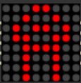
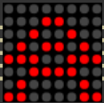
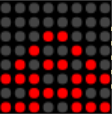

# LED Matrix Animation Project

This project demonstrates how to create animations on an 8x8 LED matrix using the `LedControl` library. The animation cycles through different frames to create a dynamic visual effect.

## Features
- Displays an animated sequence on an 8x8 LED matrix.
- Uses the `LedControl` library for controlling the LED matrix.
- Simple and efficient code for dynamic animations.

---

## Animation Frames

The animation consists of three states (frames) that cycle continuously. Below are the frames:

### State 1


### State 2


### State 3


---

## Circuit Diagram

To set up the hardware, follow the circuit diagram below:


### Components:
- **8x8 LED Matrix**
- **Arduino (or compatible microcontroller)**
- **MAX7219 Driver**
- **Wires and Breadboard**

---

## How to Run

1. Clone this repository:
   ```bash
   [git clone https://github.com/your-username/your-repo-name.git](https://github.com/MarioRMReis/Arduino_occtupusAnimation)
